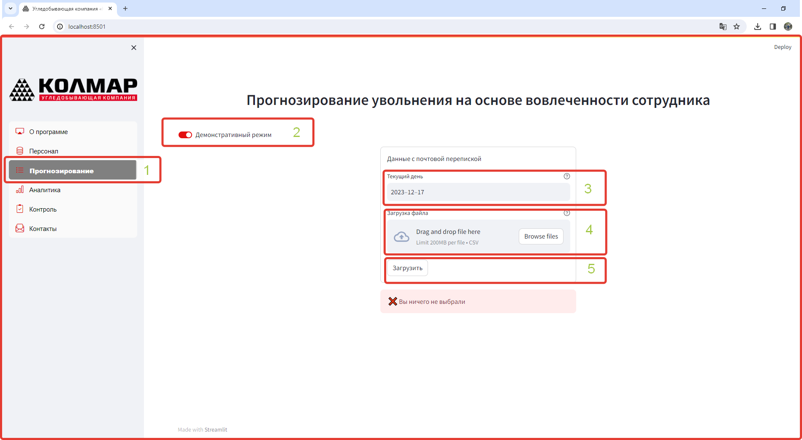
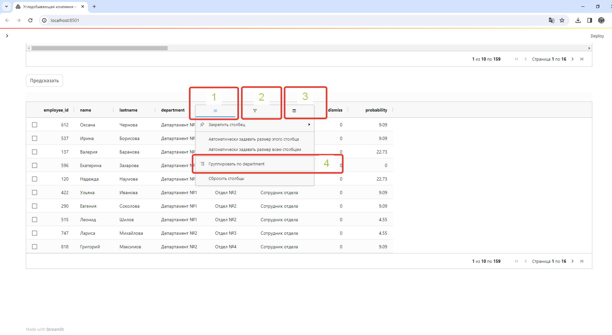

[Обратно в README:leftwards_arrow_with_hook:](https://github.com/RuslanLat/kolmar)

## СОПРОВОДИТЕЛЬНАЯ ДОКУМЕНТАЦИЯ

### Сервис предсказания вероятности увольнения сотрудников.

### 1. Краткое описание сервиса:

Сервис предоставляет возможность оценить динамику событий работы с сообщениями электронной почты и умеет:
- давать прогнозную оценку в % вероятности скорого увольнения каждого сотрудника.
- давать аналитику в разрезе отделов и департаментов по вероятности увольнения сотрудников
- с помощью подключенного телеграмм бота добавлять и удалять ответственных за текучесть сотрудников, рассылать файлы, списки сотрудников, отображать топ 3 с самым высокой вероятностью увольнения.
- осуществлять контроль за сотрудниками с высокой вероятностью увольнения с использованием чек листа и сравнительной статистикой.

### 2. Основные идеи работы сервиса:
Данные для обучения получаем за последний год, до даты начала предсказания. Интервал времени - 1 день.
Предсказание вероятности увольнения сотрудников производится моделью на данных с временным сдвигом 1 неделя, т.е. агрегированные данные за временной период 12 месяцев, но со сдвигом вперед на 1 неделю.
Переобучение модели на новых данных в соответствии с интервалом сдвига.
Визуализация результатов предсказания и аналитической информации
Уведомление ответственных лиц (email, telegram)
Чек лист ответственных сотрудников по работе с важными сотрудниками с высокой вероятностью увольнения.
Контроль изменения вероятности увольнения важных сотрудников в следующем интервале предсказания.

### 3. Пайплайн:

Получение данных из баз данных:
Данные из почтового сервиса
Данные из CRM системы
Предобработка данных
EDA
Генерация новых фичей и отбор лучших фичей
Подбор лучшей модели:
- выбор метрики, 
- подбор гипперпараметров
- выбор лучшей метрики по средней кроссвалидации

Интерпретация результатов предсказания лучшей модели, важность признаков при работе модели.
Предсказание вероятности увольнения сотрудников, все сотрудники с вероятностью более 50 % в зоне риска увольнения

Далее происходит работа ответственных сотрудников в соответствии с чек листом:
- Выявления возможных причин увольнения сотрудников
- Выявление неудовлетворенности работой.
- Выявление других возможных проблем влияющие на принятие решений по увольнению
- Принятие решений по выявленным проблемам сотрудника

Через неделю/ 2 недели/ 3 недели контрольный замер эффективности, путем сравнения результатов предсказания вероятности увольнения сотрудников посредством переобучения модели на данных с временным сдвигом в соответствии с определенными интервалами.

### 4. Описание получения данных по переписке в почтовых сервисах компании:

Данные получаем из нескольких баз данных: 
База данных хранения статистики использования почтового сервиса 
База данных хранения писем из почтовой переписки сотрудников.
База данных хранения HR статистики о персонале.

Логика выгрузки и агрегирования данных:

Основная таблица для конкатенации была таблица из HR которая содержала в себе информацию:
ФИО сотрудника \
ID сотрудника \
Пол \
Возраст \
Дата приема на работу \
Дата увольнения \
Из данной таблицы получили следующие признаки:
name - ФИО сотрудника \
employee_id - ID сотрудника \
male - Пол \
age - Возраст \
experience - из крайней даты отчетного периода или даты увольнения отняли Дата приему на работу \
target - вычислили по Дата увольнения 

Данные по численности выбирались за 12 месяцев, где учитывались все сотрудники, со стажем работы более 1 месяца (т.к. сотрудники менее одного месяца по объективным причинам имели сильно отклоняющимися данными по количественным характеристикам почтовой переписки).

Данные из базы хранения писем выгружались за 12 месяцев, данные представляли собой:
ID сотрудника к которому прикреплен почтовый адрес \
Почтовый адрес \
Текст входящего письма \
Статус ответа на входящее сообщение \
Текст исходящего письма \
Статус письма с внешними адресами (при наличии хоть 1 адресата с внешним адресом в адресе) \
Статус письма с внутренними адресами (только внутреннии адресаты) \
Дата и время письма \
Дата и время прочтения входящего письма \
Адресаты в отправленных письмах \
Адресаты в копии \
Адресаты в скрытой копии \
Вес письма в байтах.

Из данных таблиц получили следующие признаки:

answer_total - фильтровали письма по полю Статус ответа на входящее сообщение, далее группировали в разрезе ID сотрудника по строкам и группировали столбцы суммируя количество таких писем по месяца, Брали сумму значения за период.

answer_last - фильтровали письма по полю Статус ответа на входящее сообщение, далее группировали в разрезе ID сотрудника по строкам и группировали столбцы суммируя количество таких писем по месяца, брали число последнего месяца периода, если сотрудник работал 12 и более месяцев в отчетном периоде, либо последний месяц перед месяцем увольнения.

cnt_question_incoming - фильтровались входящие письма с вопросительными знаками для расчета показателя и со статусом без ответа, и группировали в разрезе ID сотрудника по строкам и группировали столбцы суммируя количество таких писем по месяца за период.

cnt_text_mean_total - рассчитывалось количество символов для исходящих сообщений, группировались данные по среднему значению в разрезе  ID сотрудника по строкам и месяцам по столбцам, далее брали среднее значение за период.

cnt_text_mean_last - рассчитывалось количество символов для исходящих сообщений, группировались данные по среднему значению в разрезе  ID сотрудника по строкам и месяцам по столбцам, далее брали значение последнего месяца периода, если сотрудник работал 12 и более месяцев в отчетном периоде либо последний месяц перед месяцем увольнения.

out_work_email_total - фильтровали письма отправленные вне рабочего времени, по полю Дата и время письма (брали время) и сравнивали со временем окончания рабочего дня. Группировали суммируя количество таких писем в разрезе ID сотрудника по строкам и группировали столбцы по месяцам. Брали сумму за период

out_work_email_last - фильтровали письма отправленные вне рабочего времени, по полю Дата и время письма (брали время) и сравнивали со временем окончания рабочего дня. Группировали суммируя количество таких писем в разрезе ID сотрудника по строкам и группировали столбцы по месяцам. Брали число последнего месяца периода, если сотрудник работал 12 и более месяцев в отчетном периоде либо последний месяц перед месяцем увольнения.

out_work_internal_email_total - фильтровали письма отправленные вне рабочего времени, по полю Дата и время письма (брали время) и сравнивали со временем окончания рабочего дня, а так же ставили фильтр по полю Статус письма с внутренними адресами, отбирая только внутреннюю переписку. Группировали суммируя количество таких писем в разрезе ID сотрудника по строкам и группировали столбцы по месяцам. Брали сумму за период

out_work_internal_email_last - фильтровали письма отправленные вне рабочего времени, по полю Дата и время письма (брали время) и сравнивали со временем окончания рабочего дня, а так же ставили фильтр по полю Статус письма с внутренними адресами, отбирая только внутреннюю переписку. Группировали суммируя количество таких писем в разрезе ID сотрудника по строкам и группировали столбцы по месяцам. Брали число последнего месяца периода, если сотрудник работал 12 и более месяцев в отчетном периоде либо последний месяц перед месяцем увольнения.

out_work_external_email_total - фильтровали письма отправленные вне рабочего времени, по полю Дата и время письма (брали время) и сравнивали со временем окончания рабочего дня, а так же ставили фильтр по полю Статус письма с внешними адресами, отбирая только внешнюю переписку. Брали сумму писем за период.

out_work_external_email_last - фильтровали письма отправленные вне рабочего времени, по полю Дата и время письма (брали время) и сравнивали со временем окончания рабочего дня, а так же ставили фильтр по полю Статус письма с внешними адресами, отбирая только внешнюю переписку. Брали число последнего месяца периода, если сотрудник работал 12 и более месяцев в отчетном периоде либо последний месяц перед месяцем увольнения.

external_email_total - фильтровали письма отправленные во вне выбирая по полю Статус письма с внешними адресами, группировали в разрезе ID сотрудника по строкам и группировали столбцы по месяцам. Брали сумму писем за период.

external_email_last - фильтровали письма отправленные во вне выбирая по полю Статус письма с внешними адресами, группировали в разрезе ID сотрудника по строкам и группировали столбцы по месяцам.  Брали число последнего месяца периода, если сотрудник работал 12 и более месяцев в отчетном периоде либо последний месяц перед месяцем увольнения.

internal_email_total - фильтровали письма отправленные внутри компании выбирая по полю Статус письма с внутренними адресами, отбирая только внутреннюю переписку. Группировали суммируя количество таких писем в разрезе ID сотрудника по строкам и группировали столбцы по месяцам. Брали сумму писем за период.

internall_email_last - фильтровали письма отправленные внутри компании выбирая по полю Статус письма с внутренними адресами, отбирая только внутреннюю переписку. Группировали суммируя количество таких писем в разрезе ID сотрудника по строкам и группировали столбцы по месяцам.  Брали число последнего месяца периода, если сотрудник работал 12 и более месяцев в отчетном периоде либо последний месяц перед месяцем увольнения.

cnt_addressees - по полю адресаты агрегировали и получали среднее количество адресатов за месяц, далее группировали значения по ID сотрудника по строкам и группировали столбцы по месяцам получая среднее количество адресатов в месяц за период.

cnt_address_copy_total - по полю адресаты в копии группировали  ID сотрудника по строкам и группировали столбцы по месяцам получая среднее количество адресатов в месяц за период. Брали среднее количество за период.

cnt_address_copy_last - по полю адресаты в копии группировали  ID сотрудника по строкам и группировали столбцы по месяцам получая среднее количество адресатов в месяц за период. Брали число последнего месяца периода, если сотрудник работал 12 и более месяцев в отчетном периоде либо последний месяц перед месяцем увольнения.

cnt_address_hidden_copy_total - по полю адресаты в скрытой копии  группировали  ID сотрудника по строкам и группировали столбцы по месяцам получая среднее количество адресатов в месяц за период. Брали среднее количество за период.

cnt_address_hidden_copy_last - по полю адресаты в скрытой копии  группировали  ID сотрудника по строкам и группировали столбцы по месяцам получая среднее количество адресатов в месяц за период. Брали число последнего месяца периода, если сотрудник работал 12 и более месяцев в отчетном периоде либо последний месяц перед месяцем увольнения.

div_bytes_emails -  по полю Вес письма в байтах получали средний показатель входящих и исходящих писем и вычисляли разницу

cnt_days_pause_total - по полям дата и время письма и дата и время прочтения письма рассчитывались показатели количества дней между получением и прочтением, группировали ID сотрудника по строкам и группировали столбцы по месяцам суммируя количество дней в месяц за период. Брали сумму дней за период.

cnt_days_pause_last - по полям дата и время письма и дата и время прочтения письма рассчитывались показатели количества дней между получением и прочтением, группировали ID сотрудника по строкам и группировали столбцы по месяцам суммируя количество дней в месяц за период. Брали число последнего месяца периода, если сотрудник работал 12 и более месяцев в отчетном периоде либо последний месяц перед месяцем увольнения.

cnt_4hours_later_total - по полям дата и время письма и дата и время прочтения письма рассчитывались показатели количества часов между получением и прочтением, группировали ID сотрудника по строкам и группировали столбцы по месяцам суммируя количество писем значение которых превышает 4 часа. Брали сумму таких писем за период

cnt_4hours_later_last - по полям дата и время письма и дата и время прочтения письма рассчитывались показатели количества часов между получением и прочтением, группировали ID сотрудника по строкам и группировали столбцы по месяцам суммируя количество писем значение которых превышает 4 часа. Брали число последнего месяца периода, если сотрудник работал 12 и более месяцев в отчетном периоде либо последний месяц перед месяцем увольнения.

Из базы данных хранения информации по использованию почтового сервиса мы также выгружали данные за 12 месяцев заданного периода, в разрезе месяца, для получения агрегированных показателей за выбранный период и последний месяц отчетного периода/последний месяц перед увольнением:
ID сотрудника
Количество использования почтового сервиса 
Количество входящих писем
Количество исходящих писем

Из данных таблиц получили следующие признаки:

received_total - из поля Количество входящих писем вычисли сумму полученных писем за период

received_last - из поля Количество входящих писем взяли цифру последнего месяца периода, если сотрудник работал 12 и более месяцев в отчетном периоде либо последний месяц перед месяцем увольнения.

total_letters_total - из поля Количество исходящих писем вычисли сумму полученных писем за период

total_letters_last - из поля Количество исходящих писем взяли цифру последнего месяца периода, если сотрудник работал 12 и более месяцев в отчетном периоде либо последний месяц перед месяцем увольнения.

active_use_email - считали количество месяцев в которых использовался почтовый сервис для каждого сотрудника

use_email_total - суммировали данные по полю Количество использования почтового сервиса

use_email_last - по полю Количество использования почтового сервиса
брали цифру последнего месяца периода, если сотрудник работал 12 и более месяцев в отчетном периоде либо последний месяц перед месяцем увольнения.

### 5. Структура данных таблиц СУБД

База данных реализована в PostgreSQL

(параметры доступа)
- host: 89.232.167.79
- port: 5432
- user: root
- password: Rtunb892
- database: postgres

**PostgreSQL** — это объектно-реляционная система управления базами данных (ORDBMS), наиболее развитая из открытых СУБД в мире. Имеет открытый исходный код и является альтернативой коммерческим базам данных.

[nosqldbm.xml](https://github.com/RuslanLat/kolmar/tree/main/data/nosqldbm.xml) - описания модели данных, [сервис](https://nosqldbm.ru/) для просмотра в интерактивном режиме

| Таблицы           | Наименование таблиц          |
|-------------------|:----------------------------:|
| admins            | админ                        | 
| users             | сотрудники                   |
| departments       | департаменты                 | 
| subdivisions      | отделы                       | 
| roles             | роли                         | 
| positions         | должности                    | 
| emails            | письма                       | 
| predicts          | предсказания                 | 
| ratings           | рейтинг                      | 
| user_bots         | служебная таблица для бота   | 
| department_bots   | служебная таблица для бота   | 
| subdivision_bots  | служебная таблица для бота   | 

### 6. Модуль оповещений и рассылки отчетов (Telegram  bot)

* [Telegram bot HR](https://t.me/+-xqRcI592AhiNTYy)
* [Telegram bot Департамента](https://t.me/+-xqRcI592AhiNTYy)
* [Telegram bot Отдела](https://t.me/+3uNhuYjW8OkwNzhi)

#### 6.1 Команды, доступные только для HR чата

***/рассылка***
	отправляет в чат и почту HR, а также ответственным руководителям файл **.csv** с отчётом  - вероятность увольнения по каждому сотруднику, находящемуся в подчинении. HR получает отчет по всем сотрудникам.  
*Примечание:* на текущий момент все отчеты отправляются на технический email. При этом данные email берутся из таблицы департаментов и отделов, соответсвующие адреса отображаются в заголовке письма ( kolmar.hr@yandex.ru )
 
***/отслеживать \<id>***
	добавляет к отслеживанию сотрудника с ID = \<id> - отображается на дашборде.

***/неотслеживать \<id>***
	убирает из отслеживания

***/инфо <id>***
	показывает краткую информацию о сотруднике с ID = \<id>

***/группа <номер группы> <id сотрудника>***  
 добавляет сотрудника с указанным ID в группу для A/B тестирования. Для удаления сотрудника из групп необходимо задать номер группы равным нулю.

#### 6.2 Команды для всех чатов

**Правила доступа:**
	* Чат отдела имеет доступ к данным только своего отдела
	* Чат депортамента имеет доступ к данным всех отделов, входящих в состав департамента

***/отчет***
***/отчет <название отдела или департамента>***
	Если указано название отдела/департамента, бот отправит файл с данными по сотрудникам отдела/департамента с указанием шанса уволиться, если нет, отправит файл со всеми данными, к которым есть доступ

***/топ3***
***/топ3 <название отдела или департамента>***
Если указано название отдела/департамента, бот отправит файл с данными по ТОП-3 сотрудникам отдела/департамента с максимальным шансом уволиться, если нет, отправит файл со всеми данными ТОП-3 сотрудников с максимальным шансом уволиться, к которым есть доступ

***/список***
***/список <название отдела или департамента>***
Если указано название отдела/департамента, бот отправит список с данными по сотрудникам отдела/департамента, если нет, отправит сообщение со всеми данными, к которым есть доступ

***/отслеживаемые /отслеживаемые <название отдела или департамента>***   
 Если указано название отдела/департамента, бот отправит список отслеживаемых сотрудников с вероятностью увольнения и дельтой к прошлому периоду по сотрудникам отдела/департамента, в противном случае, отправит сообщение с аналогичной информацией по всем доступным сотрудникам

***Комментарии:***
Данные в информационных отчетах и файлах демонстарционные, при необходимости можно доработать и выводить любые необходимые поля, которые есть в БД

#### 6.3 Технические команды:

***/номерчата***
 отображает номер текущего чата, чтоб можно было ему дать доступ

***/команды***
список команд

#### 6.4 В реализации:

Для HR чата сделать команду, которая будет давать права доступа для других чатов
На текущий момент все доступы "захардкожены"”", далее все доступы могут быть доступны на основе данных из БД

### 7. Описание структуры входных и выходных данных

#### 7.1 Входные данные

Файл в формате **CSV** разделитель **,**

[Обазец файла](https://github.com/RuslanLat/kolmar/tree/main/data/test_1_day.csv) - для загрузки в модель
*Примечание*
сотрудник предварительно должен быть занесен в CRM системы кадровой службы, в случае отсутствия предсказание для всего файла не будет сделано, сервис выдаст ошибку 

| Наименование признака          | Значение признака                                                          | Тип данных |
|--------------------------------|----------------------------------------------------------------------------|:----------:|
| employee_id                    | id сотрудника                                                              | int64      | 
| male                           | пол                                                                        | int64      | 
| age                            | возраст                                                                    | int64      | 
| experience                     | опыт в днях                                                                | int64      | 
| use_email_total                | вход в почту итого за анализируемый период                                 | int64      | 
| active_use_email               | количество активных дней использования почты за анализируемый период       | int64      | 
| use_email_last                 | вход в почту итого за последний месяц перед предсказанием                  | int64      | 
| out_work_internal_email_total  | отправка писем итого внутри компании вне рабочего времени                  | int64      | 
| out_work_internal_email_last   | отправка писем последний месяц внутри компании вне рабочего времени        | int64      | 
| out_work_external_email_total  | отправка писем итого внешним компаниям вне рабочего времени                | int64      | 
| out_work_external_email_last   | отправка писем последний месяц внешним компаниям вне рабочего времени      | int64      | 
| cnt_days_pause_total           | итого количество дней между получением письма и его прочтением             | int64      | 
| cnt_days_pause_last 	          | количество дней между получением письма и его прочтением в послений месяц  |	int64      |
| cnt_4hours_later_total         | количество писем итого прочитанных более чем через 4 часа	                 |	int64      |
| cnt_4hours_later_last 	        | количество писем в последний месяц прочитанных более чем через 4 часа	     |	int64      |
| total_letters_total 	          | итого отправленных писем	                                                  |	int64      |
| total_letters_last	            | количество писем отправленных в последний месяц	                           |	int64      |
| received_total	                | итого полученных сообщений	                                                |	int64      |
| received_last            	     | полученные сообщения в последний месяц	                                    |	int64      |
| answer_total 	                 | итого сообщенний на который направлен ответ	                               |	int64      |
| answer_last 	                  | сообщенния за последний месяц на который направлен ответ	                  |	int64      |
| out_work_email_total	          | отправка писем итого вне рабочего времени	                                 |	int64      |
| out_work_email_last	           | отправка писем последний месяц вне рабочего времени	                       |	int64      |
| external_email_total           |	отправка писем итого внешним компаниям	                                    |	int64      |
| external_email_last 	          | отправка писем последний месяц внутри компании	                            |	int64      |
| internal_email_total           |	отправка писем итого внутри компании	                                      |	int64      |
| internall_email_last           | отправка писем последний месяц внутри компании	                            |	int64      |
| cnt_addressees	                | количество адресатов в отправляемых сообщениях;	                           |	int64      |
| cnt_address_copy_total	        | количество сообщений с адресатами в поле "копия", всего за период	         |	int64      |
| cnt_address_copy_last	         | количество сообщений с адресатами в поле "копия", в последний месяц	       |	int64      |
| cnt_address_hidden_copy_total	 | количество сообщений с адресатами в поле «скрытая копия» итого за период	  |	int64      |
| cnt_address_hidden_copy_last	  | количество сообщений с адресатами в поле «скрытая копия» в последний месяц |	int64      |
| div_bytes_emails	              | отношение объема в байтах получаемых и отправляемых сообщений	             | float64    |
| cnt_question_incoming	         | количество входящих сообщений, имеющих вопросительные знаки в тексте, но на которые не был направлен ответ.      | int64      |                                      
| cnt_text_mean_total	           | среднее количество символов в отправлемых письмах за аналищируемый период	 | float64    |
| cnt_text_mean_last	            | среднее количество символов в отправлемых письмах в последний месяц	       | float64    | 

#### 7.2 Выходные данные

| Наименование признака          | Значение признака                                                          | Тип данных |
|--------------------------------|----------------------------------------------------------------------------|:----------:|
| employee_id                    | id сотрудника                                                              | int64      | 
| name                           | имя                                                                        | object     | 
| lastname                       | фамилия                                                                    | object     | 
| department                     | департамент                                                                | object     | 
| subdivision                    | отдел                                                                      | object     | 
| position                       | должность                                                                  | object     | 
| dismiss                        | метка класса (1 - уволить, 0 - не уволить )                                | int64      | 
| probability                    | вероятность увольнения                                                     | float64    | 

Доступна выгрузка выходных данных в файл
* в формате **CSV** разделитель **,**
* в формате **XLSX** MS Office

### 8. WEB - сервис

Web сервис сотрудника кадровой службы взаимодействует с базой данной (см. раздел 5) посредствам API (см. раздел 9)

[Web сервис](http://46.243.227.129:5981/) - ссылка на сервис
 

#### 8.1 Домашняя страница

* 1 - меню
* 2 - рабочая област
*Примечание*
меню возможно скрыть при нажатии на **Х**, обратное отображение меню при нажатии на  **>**

#### 8.2 Персонал

* 1 - переход на страницу  "Персонал"
* 2 - имитация CRM системы кадровой службы
*Примечание*
доступны справочники департаментов, отделов, персонала (должности, роли, сотрудники, структура штата)

Типовая вкладка справочника
* 1 - переход на страницу  "Персонал"
* 2 - выбор справочника "Департаменты"
*Примечание*
форма ввода данных, возможно добавление/удаление данных (на время хакатона не доступно во избежание утраты данных из базы данных)
* 3 - вывод данных

#### 8.3 Прогнозирование

* 1 - переход на страницу  "Прогнозирование"
* 2 - включение/отключение демонстрационного режима
*Примечание*
при демонстрационном режиме возможно задать пользовательскую текущею дату
* 3 - выбор текущей даты
*Примечание*
при отключении демонстрационного режима автоматический определяется текущая дата
* 4 - загрузка данных (см. раздел 7.1)
*Примечание*
необходимо перетащить файл в окно загрузки или кликнуть левой клавишей мыши окно загрузки/или нажать кнопку Browse files и задать пользовательский путь к файлу
* 5 - после выбора файла нажать кнопку "Загрузить"

После нажатия на кнопку "Загрузить"
* 1 - уведомление об успешной загрузке
* 2 - отображение наименования загруженного файла
* 3 - предпросмотр загруженного файла
*Примечаие*
		- доступно перелистывание страниц/переход на начальную или последнею  страницу (навигатор в правом нижнем углу таблицы)
		- в навигаторе указано общее количество строк записей в файле
		- данные выводядся по 10 строк
* 4 - для получения результатов предсказания моделью нажать кнопку "Предсказать"

* 1 - результат предсказания (см. раздел 7.2)

*Примечание*
		- результат предсказания автоматический сохраняется в базу данных
		- данные предсказываемого файла также автоматический сохраняются в базу данных

#### Основные возможности работы с результатом предсказания

* 1 - при клике левой кнопкой мыши по левой/правой стороне каждого столбца, в зависимости от его расположения относительно срединного столбца доступно меню по работе и анализу данных (три полоски)

* 1 - основная рабочая область
* 2 - фильтрация данных
* 3 - выбор отображаемых столбцов
* 4 - группировка по выбранному столбцу

* 2 - фильтрация данных
*Примечание*
для фильтраии данных необходимо ввести требуюмую информацию в строку поиска (фильтрация данных и логика работы зависит от типа данных) или прокликать мышью по галочкам, далее нажать Enter на клавиатуре

 

* 3 - выбор отображаемых столбцов
для отображения столбцов необходимо ввести требуюмую информацию в строку поиска или прокликать мышью по галочкам, далее нажать Enter на клавиатуре

Возможность выгрузки данных в файл **CSV**  или **XLSX** MS Office
Для выгрузки данных в файл необходимо кликнуть правой клавишей мыши по любому месту рабочей области таблицы

* 1 - выбрать "Экспорт"
* 2 - выбрать желаемый вариант файла
*Примечание*
состояние файла при выгрузке запоминается в зависимости от фильтрации или группировки данных

Смена очередности отображения столбцов
Для этого необходимо зажать требуемый столбец левой кнопкой мыши и перенести в требуемое место

* 1 - перемещение столбца

Возможный вариант группировки данных

* 1 - группировка данных
*Примечание*
состояние файла при выгрузке запоминается в зависимости от фильтрации или группировки данных
* 2 - сортировка данных по возрастанию/убыванию
*Примечание*
для сортировки данных необходимо кликнуть по заглавию сортируемого столбца

#### 8.4. Аналитика

* 1 - переход на страницу "Аналитика"
* 2 - вкладки анализа
* 3 - дашборд
*Примечание*
[Расширенная инструкция](https://cloud.yandex.ru/docs/datalens/) по порядку работы в дашборде

#### 8.5. Контроль

* 1 - переход на страницу "Контроль"
* 2 - рабочая область (анкета)
*Примечание*
в стадии разработке

#### 8.6. Контакты

* 1 - переход на страницу "Контакты"
* 2 - контакты команды

### 9 API

[API](http://89.232.160.71:8080/docs) - документация на API
***Примечание***
*все методы доступны только авторизованному пользователю логин - user, пароль - user, метод - /user.login*