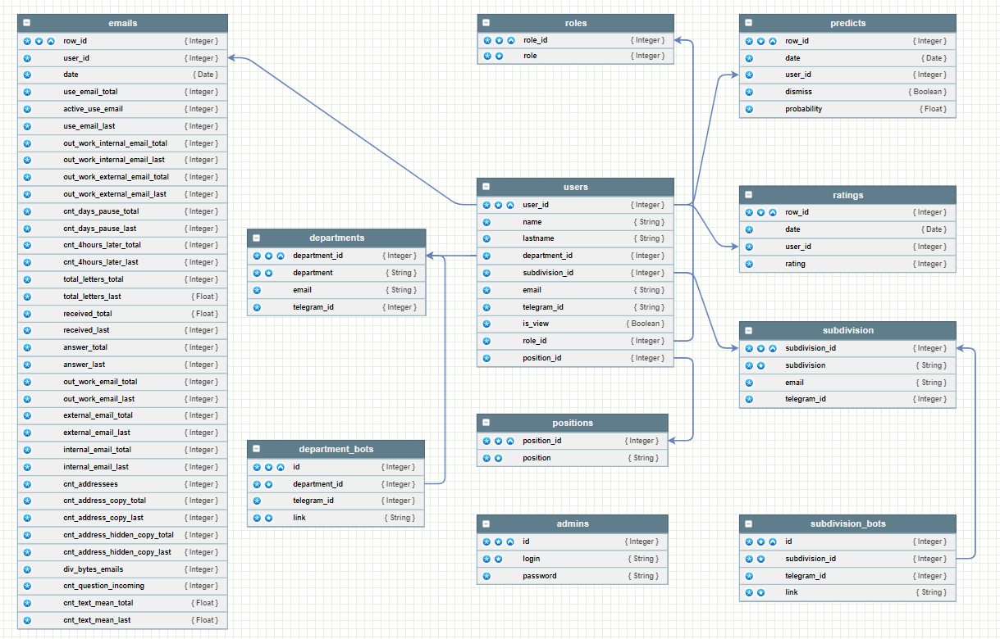

# kolmar

[**Лидеры цифровой трансформации**](https://i.moscow/lct/yakutia), Якутия, 2023

Задача №2 "Сервис прогнозирования увольнения на основе вовлеченности сотрудника"

1. [Презентация](presentation.pdf)
2. Код с проектом
* [Web сервис](https://github.com/RuslanLat/kolmar/tree/main/frontend)
* [API](https://github.com/RuslanLat/kolmar/tree/main/backend)
* [Модель](https://github.com/RuslanLat/kolmar/tree/main/ml_model)
* [Telegram bot](https://github.com/RuslanLat/kolmar/tree/main/bots)

3. Решение
* [Web сервис](http://46.243.227.129:5981/)
 
* [API](http://89.232.160.71:8080/) \
***Примечание***
*все методы доступны только авторизованному пользователю логин - user, пароль - user, метод - /user.login*
#####
* база данных (параметры доступа)
    - host: 89.232.167.79
    - port: 5432
    - user: root
    - password: Rtunb892
    - database: postgres
* [Telegram bot HR](https://t.me/+-xqRcI592AhiNTYy)
* [Telegram bot Департамента](https://t.me/+-xqRcI592AhiNTYy)
* [Telegram bot Отдела](https://t.me/+3uNhuYjW8OkwNzhi)

4. [Модель](data/nosqldbm.xml) данных, [сервис](https://nosqldbm.ru/) для просмотра в интерактивном режиме

5. Документация
* [Сопроводительная документация](DOCS.md)
* [API](http://89.232.160.71:8080/docs)

Команда **"К"** \
Руслан Латипов  @rus_lat116 \
Юрий Дон  @Yuriy_Nikitich \
Татьяна Моисеева  @Estochka \
Алексей Верт-Миллер  @alexwert3 \
Виталий Ерохин  @warleagle

